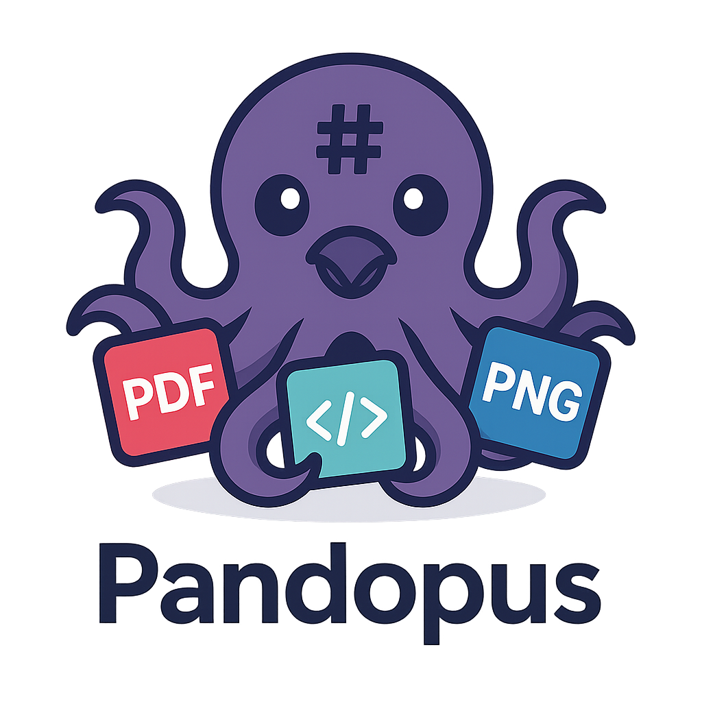
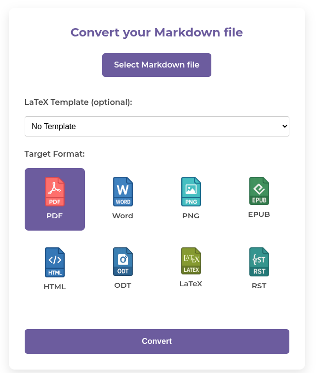

# Pandopus – Markdown Conversion Webservice

Pandopus is an open source web service that converts Markdown documents into a variety of output formats. Built on Flask and Pandoc, the application is distributed as a Docker container to ensure a consistent and reproducible environment. 



---

## 1. Project Overview

Pandopus is designed for developers and content creators who need a straightforward solution for converting Markdown documents into multiple formats. The service simplifies the conversion process and provides API endpoints for integrating into automated workflows.

- **Technologies:** Flask, Pandoc, Docker
- **Purpose:** Web-based conversion of Markdown to formats such as PDF, DOCX, PNG, EPUB, HTML, ODT, LaTeX, and RST.
- **Open Source:** Licensed under the MIT License and welcomes community contributions.

---

## 2. Features

- **Multiple Output Formats:**  
  Easily convert Markdown into PDF, DOCX, PNG, EPUB, HTML, ODT, LaTeX, and RST.

- **Customizable LaTeX Templates:**  
  Users can select from custom LaTeX templates to tailor the output to their needs.

- **Docker Containerization:**  
  The entire application is packaged as a Docker container for simple deployment—*x86_64 systems only*.

---

## 3. Installation & Setup (Docker Only)

This project is distributed exclusively as a Docker container.
> **Note:** This Docker image is built exclusively for x86_64 systems and will not work on ARM-based devices (e.g., Raspberry Pi).

### Prerequisites

- [Docker](https://www.docker.com/) (compatible with x86_64 systems)
- [Docker Compose](https://docs.docker.com/compose/) (optional but recommended)

### Docker Compose Configuration

Create a file named `docker-compose.yml` in the root of your project with the following content:

```yaml
version: '3'
services:
  pandoc-webservice:
    image: theklave/pandoc-webservice:latest
    container_name: pandoc-webservice
    ports:
      - "8777:8777"
    volumes:
      - ./latex_templates:/app/latex_templates

volumes:
  latex_templates:
```

---

## Credits & Acknowledgements

Pandopus is built on top of several excellent open source projects. We extend our gratitude to the communities and developers behind these tools, which make this service possible:

- **Pandoc**  
  A universal document converter, licensed under the [GPL](https://www.gnu.org/licenses/gpl-3.0.html).

- **MikTeX**  
  A comprehensive TeX/LaTeX distribution that serves as the base image for our Docker container. Please refer to the [MikTeX website](https://miktex.org/) for licensing details.

- **ImageMagick**  
  Provides powerful image processing capabilities, licensed under [Apache 2.0](https://imagemagick.org/script/license.php).

- **Ghostscript**  
  Used for PDF processing, available under the [GNU AGPL](https://www.gnu.org/licenses/agpl-3.0.html).

- **Python**  
  The programming language used for developing this web service.

- **Gunicorn**  
  A robust WSGI HTTP server used to run the Flask application in production.

These projects and tools are key to the functionality of Pandopus. For more details on their respective licenses and contributions, please visit their official websites.
